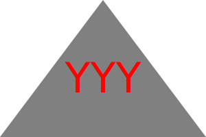

 

# The SVG LOGO Generator!

## logo.svg files for days!

Table of Contents
  
  * [Description](#description)
  * [How to](#usage)
  * [License](#licenseSection)
  * [Contact](#Contact-Me!)

### Description   
   This project has been created to make a logo.svg file via a questionnaire invoked via PowerShell. You can then use that svg file on any of your projects which you can quickly copy and paste into its folder accordingly. 
  
### How to  
   To deploy this, you will need to have the OOP SVG Logo Maker file conglomeration along with node and all its dependencies then you will need to invoke the index.js via terminal (node index.js) and proceed with the question asked to have a finished logo.svg. 

Project Contributors: N/A 

  
#### Project License: MIT  
https://opensource.org/licenses/MIT

### Github

https://github.com/yoboyyash  
   
Youtube demo for this project: https://youtu.be/wwESulAxOcY 

# Contact Me!  

yashrajbaviskar@gmail.com 

